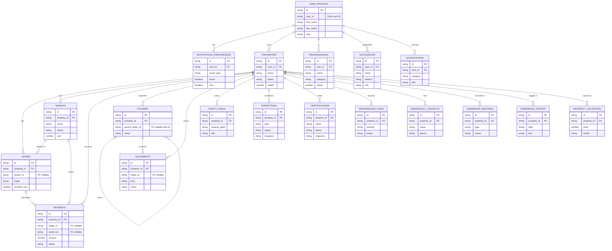

# Entity Relationship Diagram

> Snapshot of every entity in the codebase and their relationships, hand-derived from the Zod schemas at `lib/data/types/`. Last regenerated: 2026-05-05.

## Coverage

- **Included:** 19 entities — every file in `lib/data/types/` except `_common.ts`.
- **Excluded from diagram (no schema exists):** 4 entities still in design phase:
  - LandParcel — blocked on Q4.R (denormalized vs separate table)
  - CoOwner — blocked on Q4.N (PII handling)
  - MarketSnapshot — blocked on Q4.Q (external data source)
  - MarketComparable / PropertyComparable — blocked on Q4.Q + Q4.R
  - RentalEvent — referenced in catalog §8; no `lib/data/types/rental-event.ts` yet
  - EstateDocument — referenced in catalog §15; no `lib/data/types/estate-document.ts` yet
  These will be added when each entity's Zod schema lands.
- **Field detail:** the diagram shows 3–5 fields per entity (PK + FKs + 1–2 distinguishing fields). For full field shape including Zod constraints, read the source file directly.

## Deviations from initial plan

The following schema details differ from the plan's draft diagram and were corrected during Step A:

| Entity | Plan assumed | Actual schema |
|---|---|---|
| `Inspection` | `professional_id` FK | `inspector: string` — no FK to PROFESSIONALS |
| `Certification` | `professional_id` FK | `inspector: string` — no FK to PROFESSIONALS |
| `Notification` | `property_id` nullable FK | No `propertyId` field; user-scoped only |
| `Successor` | `property_id` FK | No `propertyId`; user-level estate planning |
| `NotificationPreference` | `email_frequency` field | `eventType`, `email`, `slack`, `sms` (per-event toggles) |
| `Folder` | No self-reference noted | `parentFolderId` optional self-FK for nested folders |
| `OwnershipHistory` | `transferred_at: number` | `date: string` (formatted date string) |
| `EmergencyContact` | `role` field | No `role`; has `sub` (optional subtitle) |

## How this was made

- Hand-derived from `lib/data/types/<entity>.ts` Schema definitions, reading each file directly.
- Cardinality inferred from FK shape: `<entity>Id: idSchema` (optional) → `}o` on the owning side.
- `userId` fields use `userIdSchema` from `_common.ts` — treated as FK to `USER_PROFILES.user_id` (Clerk auth ID), not to `USER_PROFILES.id` (Convex document ID). The diagram elides this distinction for readability.
- Snake_case used in the diagram; actual TypeScript fields are camelCase.
- `PROFESSIONALS` relationships to `INSPECTIONS`/`CERTIFICATIONS` were removed: no FK exists in the schemas. The `inspector` field on both entities is a plain string.

## Regeneration

When entities or relationships change, this file goes stale. Two options:

- **Hand-update** — find the affected entity in the diagram, edit. Bump the date stamp. ~5 min per change.
- **Auto-generate** (not yet built) — `scripts/derive-erd.ts` would walk every Zod schema's `.shape`, derive fields + FKs from atom usage (`propertyIdSchema`, `userIdSchema`, `idSchema`), emit this same Mermaid block. ~30 min one-time build; thereafter the diagram regenerates on every schema change. File as a future workstream.
