# Valgate — Entity Relationship Diagram

> Source-of-truth: `lib/data/types/*.ts` Zod schemas. Cross-reference: `../ref/07-entity-fields.md`.

```mermaid
erDiagram
    %% =====================================================================
    %% Crow's-foot relationships
    %%   ||--o{ : one-to-many (mandatory parent, optional child)
    %%   ||--|{ : one-to-many (mandatory both)
    %%   }o--o{ : many-to-many
    %%   ||--|| : one-to-one
    %% =====================================================================

    users ||--o{ properties : owns
    users ||--o{ user_profiles : has
    users ||--o{ professionals : has_directory
    users ||--o{ successors : has
    users ||--o{ notifications : receives
    users ||--o{ notification_preferences : configures
    users ||--o{ estate_activity_events : logs

    properties ||--o{ tenants : houses
    properties ||--o{ leases : contains
    properties ||--o{ payments : tracks
    properties ||--o{ expenses : incurs
    properties ||--o{ documents : has
    properties ||--o{ folders : organizes
    properties ||--o{ inspections : audits
    properties ||--o{ certifications : holds
    properties ||--o{ safety_risks : exposes
    properties ||--o{ emergency_contacts : has
    properties ||--o{ maintenance_items : needs
    properties ||--o{ property_valuations : valued_by
    properties ||--o| land_parcels : sits_on
    properties ||--o{ co_owners : split_among
    properties ||--o| ownership_records : structured_as
    properties ||--o{ ownership_documents : titled_by
    properties ||--o{ ownership_history : changes_over
    properties ||--o{ successor_property_assignments : assigned_to
    properties ||--o{ notifications : scopes
    properties ||--o{ estate_activity_events : scopes

    tenants ||--o{ leases : signs
    tenants ||--o{ payments : makes

    leases ||--o{ payments : generates

    folders ||--o{ documents : contains
    folders ||--o{ folders : nests

    successors ||--o{ successor_property_assignments : assigned_via

    %% =====================================================================
    %% Entity field tables (key fields only; full set in ref/07)
    %% =====================================================================

    users {
        text id PK "Clerk subject"
    }

    properties {
        text id PK
        text user_id FK
        text name
        text code
        property_type_choice type "8-enum"
        property_status status "6-enum incl. Owner-Occupied"
        int health "0-100, Q5.K drop"
        double lat
        double lng
        text province
        numeric buy_numeric "canonical purchase $"
        numeric current_market_value
        text title "Hard|Soft|—"
        bigint created_at
        bigint updated_at
    }

    tenants {
        text id PK
        text user_id FK
        text property_id FK
        text name
        text unit
        numeric rent
        tenant_status status
        text email
        text phone
    }

    leases {
        text id PK
        text user_id FK
        text property_id FK
        text tenant_id FK "optional"
        text unit
        lease_stage stage "Approaching|Offered|Signed|Declined"
        bigint start_date
        bigint end_date
        numeric monthly_rent
        int term_months
    }

    payments {
        text id PK
        text user_id FK
        text property_id FK
        text lease_id FK "optional"
        text tenant_id FK "optional"
        bigint date
        payment_kind kind "Rent|Fee|Deposit|Refund"
        numeric amount
        text method
        payment_status status "Paid|Pending|Failed|Overdue"
    }

    expenses {
        text id PK
        text user_id FK
        text property_id FK
        bigint date
        expense_category category "6-enum"
        numeric amount
        text note
    }

    documents {
        text id PK
        text user_id FK
        text property_id FK
        text folder_id FK "optional"
        text name
        document_kind kind "photo|document"
        text mime_type
        text storage_id "→ Convex _storage"
        text category "Q5.R open string"
        bigint uploaded_at
    }

    folders {
        text id PK
        text user_id FK
        text property_id FK
        text parent_folder_id FK "self-FK"
        text name
        bigint created_at
    }

    inspections {
        text id PK
        text user_id FK
        text property_id FK
        text date "A1 should be bigint"
        text type
        text inspector
        text status "A3 Passed|Failed|Pending"
        int issues
    }

    certifications {
        text id PK
        text user_id FK
        text property_id FK
        text name
        text status "A3 Valid|Expiring|Expired"
        text issued "A1 should be bigint"
        text expires "A1 should be bigint"
        text inspector
    }

    safety_risks {
        text id PK
        text user_id FK
        text property_id FK
        text severity_label "A3 High|Medium|Low"
        text title
        text desc
    }

    emergency_contacts {
        text id PK
        text user_id FK
        text property_id FK
        text name
        text phone
        text sub
    }

    maintenance_items {
        text id PK
        text user_id FK
        text property_id FK
        maintenance_severity severity "Emergency|Urgent|Standard"
        text title
        maintenance_status status "Open|InProgress|Resolved"
        bigint created_at
        numeric cost "Phase 6.8b"
    }

    property_valuations {
        text id PK
        text user_id FK
        text property_id FK
        text month "MMM YYYY"
        numeric price
        bigint recorded_at
    }

    land_parcels {
        text id PK
        text user_id FK
        text property_id FK
        numeric size_m2
        numeric width_m
        numeric length_m
        text zoning_code
        terrain_type terrain_type "Flat|Rolling|Hilly|Mountainous|Mixed"
    }

    co_owners {
        text id PK
        text user_id FK
        text property_id FK
        text name
        co_owner_role role "Primary|Minor"
        numeric share_percent "0-100"
        text email
        text ssn_masked "PII Q5.S"
        tax_entity tax_entity "7-enum"
    }

    ownership_records {
        text id PK
        text user_id FK
        text property_id FK
        holding_type holding_type "6-enum"
        text loan_type
        numeric loan_amount
        int loan_term_years
        bigint origination_date
        bigint maturity_date
        bigint next_payment_due
        text lender_name
        distribution_method distribution_method "3-enum"
    }

    ownership_documents {
        text id PK
        text user_id FK
        text property_id FK
        text name
        text type
        text date "A1 should be bigint"
        text owner
    }

    ownership_history {
        text id PK
        text user_id FK
        text property_id FK
        text date "A1 should be bigint"
        text text
        text color "A7 presentational"
    }

    successors {
        text id PK
        text user_id FK
        text name
        text initials
        text relation
        successor_role role "primary|contingent"
        numeric share
        boolean verified
    }

    successor_property_assignments {
        text id PK
        text user_id FK
        text successor_id FK
        text property_id FK
        bigint created_at
        bigint updated_at
    }

    estate_activity_events {
        text id PK
        text user_id FK
        estate_activity_kind kind "7-enum"
        text title
        text description
        text property_id FK "optional"
        bigint created_at
    }

    professionals {
        text id PK
        text user_id FK
        text name
        text company
        text category "A3 should be 8-enum"
        numeric rating "0-5"
        int review_count
        int linked_properties "PF6 scalar"
        boolean available
        text email "validated"
        text phone
        boolean verified
    }

    user_profiles {
        text id PK
        text user_id FK
        text first_name
        text last_name
        text job_title
        text email
        text phone
        text language
        text timezone
        text role "Q4.X open string"
        text dashboard_view "Q5.X"
        bigint member_since
        bigint last_login
    }

    notifications {
        text id PK
        text user_id FK
        text property_id FK "optional"
        notification_category category "MAINTENANCE|LEASING|COMPLIANCE|PAYMENT|APPLICATIONS"
        text title
        text description
        bigint created_at
        boolean read
        text link_to
    }

    notification_preferences {
        text id PK
        text user_id FK
        text event_type
        boolean email
        boolean slack
        boolean sms
    }
```

## Notes for the diagram reader

- **Hub:** `properties` — 18 of the 25 entities link to it (directly or via a join table)
- **Self-FK:** `folders.parent_folder_id → folders.id` (recursive folder tree)
- **Join table:** `successor_property_assignments` resolves the many-to-many between `successors` and `properties` (Q4.V resolution)
- **Anomalies** (date-as-string, open-string status, etc.) are flagged in column comments — see `../ref/07-entity-fields.md` §5 for the full A1–A12 list

---

_Source: `lib/data/types/*.ts` (current Zod state). Cross-reference: `.claude/data-audit/ref/07-entity-fields.md`._
