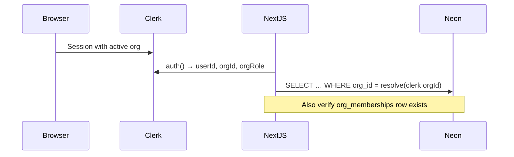

# Valgate identity model (Clerk Organizations)

> **Source of truth for auth:** [Clerk Organizations](https://clerk.com/docs/guides/organizations/overview)  
> **DDL:** [`prototype/schema.sql`](./prototype/schema.sql) (identity section)  
> **Neon:** mirror Clerk via webhooks; enforce tenancy with `org_id` on domain data.

---

## Principles

1. **Clerk owns identity** — users, organizations, memberships, roles, active org in session.
2. **Neon owns portfolio data** — properties, documents, leases, etc., keyed by **`org_id`**.
3. **Never use `user_id` as the tenancy key** on domain tables — use `org_id` + Clerk session `orgId`.
4. **`user_id` / `created_by_user_id`** — audit only (who created a row), not authorization.
5. **Professionals (Bobby, Alice)** — same Clerk **users**, multiple **org memberships** with custom roles (`org:asset_manager`, `org:lawyer`), not a separate auth system.

---

## Clerk ↔ Valgate mapping

| Clerk | Valgate meaning | Neon table.column |
|-------|-----------------|-------------------|
| `user_…` | Human (owner, Bobby, Alice) | `users.id` = `users.clerk_user_id` |
| `org_…` | **Client workspace** (Org A, B, C) | `organizations.id` = `organizations.clerk_org_id` |
| Organization membership | User belongs to org with a role | `org_memberships` |
| Active org in session | Current portfolio context | `auth().orgId` → resolve `organizations.id` |
| `org:admin`, `org:member` | Default Clerk roles | `org_memberships.role` |
| `org:asset_manager`, `org:lawyer`, … | Custom roles (Dashboard) | `org_memberships.role` |
| Organization slug | URL / switcher (`/orgs/:slug`) | `organizations.slug` |

### Two product sides, one Clerk app

| Side | Who | Clerk pattern |
|------|-----|----------------|
| **Owner department** | Family / family office | Creates or joins **Org A**; members with `org:admin` / `org:member` |
| **Professional department** | Asset manager, lawyer, renter (PM) | **One user**, **many orgs**, **role per org** (e.g. Bobby → A+C as `org:asset_manager`; Alice → A,B,C as `org:lawyer`) |

Example (demo IDs in tests):

| User | Clerk-style id | Memberships |
|------|----------------|-------------|
| Owner | `user_owner` | `org_a` → `org:admin` |
| Bobby | `user_bobby` | `org_a`, `org_c` → `org:asset_manager` |
| Alice | `user_alice` | `org_a`, `org_b`, `org_c` → `org:lawyer` |

---

## Neon tables (identity section)

### `organizations`

Mirror of Clerk Organization.

| Column | Notes |
|--------|--------|
| `id` | Prototype: same as `clerk_org_id` (`org_…`). Production: internal UUID + unique `clerk_org_id`. |
| `clerk_org_id` | `org_…` from Clerk |
| `slug` | From Clerk; unique |
| `name` | Display name |
| `metadata` | JSONB; optional mirror of Clerk public/private metadata |

### `users`

Mirror of Clerk User (not to be confused with “owner” as a business term).

| Column | Notes |
|--------|--------|
| `id` | Prototype: same as `clerk_user_id` (`user_…`) |
| `clerk_user_id` | `user_…` |
| `primary_email` | From Clerk |
| `display_name`, `avatar_url` | Optional mirror |

### `org_memberships`

Mirror of Clerk organization membership.

| Column | Notes |
|--------|--------|
| `id` | Internal row id (prototype `om_…`) |
| `clerk_membership_id` | When available from webhook payload |
| `org_id` | → `organizations` |
| `user_id` | → `users` |
| `role` | Clerk role key: `org:admin`, `org:member`, `org:asset_manager`, … |
| `status` | `active` \| `invited` \| `suspended` \| `removed` |
| **Unique** | `(org_id, user_id)` |

### Domain tables (portfolio)

All tenant data includes:

```sql
org_id TEXT NOT NULL REFERENCES organizations(id)
```

Optional on create:

```sql
created_by_user_id TEXT REFERENCES users(id)
```

**Not** `user_id` for tenancy.

### Special cases

| Table | Scoping |
|-------|---------|
| `user_profiles` | Per **user** (`user_id`) — profile across orgs |
| `notification_preferences` | Per **user** (may later become `(org_id, user_id)`) |
| `professionals` | Per **org** — owner’s directory / marketplace cards, **not** Clerk membership |
| `notifications` | Per **org** (+ optional `property_id`) |

---

## Server authorization flow



```ts
import { auth } from "@clerk/nextjs/server";

export async function requireOrgContext() {
  const { userId, orgId, orgRole } = await auth();
  if (!userId) throw new Error("Unauthorized");
  if (!orgId) throw new Error("No active organization");

  // Resolve Clerk org_… → organizations.id (same string in prototype)
  // Optional: verify membership in org_memberships for userId + orgId
  return { userId, orgId, orgRole };
}
```

**Rules**

- Do not accept `orgId` from the client body without matching session `orgId`.
- Use Clerk [custom permissions](https://clerk.com/docs/guides/organizations/roles-and-permissions) for fine-grained checks (`has({ permission: "org:properties:read" })`).
- Multi-tab: for background fetches, use `getToken()` so the JWT matches the tab’s active org ([Clerk docs](https://clerk.com/docs/guides/organizations/overview)).

---

## Webhook list (sync Clerk → Neon)

Endpoint: `POST /api/webhooks` — verify with `verifyWebhook` from `@clerk/nextjs/webhooks`.  
Store `CLERK_WEBHOOK_SIGNING_SECRET` in env. Route must be **public** in `clerkMiddleware`.

Subscribe in [Clerk Dashboard → Webhooks](https://dashboard.clerk.com/last-active?path=webhooks):

### Users

| Event | Action in Neon |
|-------|----------------|
| `user.created` | `INSERT` into `users` (`clerk_user_id`, email, name) |
| `user.updated` | `UPDATE users` by `clerk_user_id` |
| `user.deleted` | Soft-delete or `DELETE` user; handle memberships |

### Organizations

| Event | Action in Neon |
|-------|----------------|
| `organization.created` | `INSERT` into `organizations` |
| `organization.updated` | `UPDATE organizations` (name, slug, metadata) |
| `organization.deleted` | Archive org; cascade policy TBD |

### Memberships (critical)

| Event | Action in Neon |
|-------|----------------|
| `organizationMembership.created` | `INSERT` into `org_memberships` |
| `organizationMembership.updated` | `UPDATE` role / status |
| `organizationMembership.deleted` | Set `status = removed` or delete row |

### Invitations (optional, phase 2)

| Event | Action in Neon |
|-------|----------------|
| `organizationInvitation.created` | Track pending invite if needed |
| `organizationInvitation.accepted` | Usually followed by `organizationMembership.created` |

### Session (optional)

| Event | Use |
|-------|-----|
| `session.created` / `session.ended` | Analytics only; not required for RLS |

**Payload types:** import from `@clerk/nextjs/webhooks` — `UserJSON`, `OrganizationJSON`, `OrganizationMembershipJSON`.

**Idempotency:** upsert on `clerk_user_id`, `clerk_org_id`, `(org_id, user_id)` using webhook `id` or payload id to avoid duplicate processing.

---

## App integration checklist

- [ ] Enable **Organizations** in Clerk Dashboard
- [ ] Define custom roles: `org:asset_manager`, `org:lawyer`, `org:renter` (or `org:property_manager`)
- [ ] Define custom permissions: e.g. `org:properties:read`, `org:properties:manage`, `org:documents:manage`
- [ ] `clerkMiddleware` + optional `organizationSyncOptions` for `/orgs/:slug`
- [ ] `<OrganizationSwitcher />` in owner shell; pro shell lists orgs from memberships
- [ ] Webhook route `app/api/webhooks/route.ts`
- [ ] All Server Actions call `requireOrgContext()` and filter by `org_id`
- [ ] `npm run db:test` passes with org-scoped flow tests

---

## Custom roles (recommended starting set)

| Role key | Side | Typical access |
|----------|------|----------------|
| `org:admin` | Owner | Full org + membership management (Clerk default) |
| `org:member` | Owner | Read members; limited write (Clerk default) |
| `org:asset_manager` | Pro | Manage properties, valuations, reports for client org |
| `org:lawyer` | Pro | Documents, ownership, succession, compliance |
| `org:renter` | Pro | Leases, tenants, payments (property manager) |

Configure in Clerk Dashboard → **Roles & Permissions**; assign via invitations or verified domains.

---

## Testing identity

Flow tests should seed `organizations`, `users`, `org_memberships`, then insert domain rows with `org_id`.

Example: Bobby can write to `org_a` but must not read `org_b` — add `scripts/db/tests/flows/05_org_membership_access.sql` when authorization tests are ready.

Run: `npm run db:test`

---

## Related docs

- [Database testing](./testing.md)
- [Writing a test](./writing-a-test.md)
- [Clerk Organizations overview](https://clerk.com/docs/guides/organizations/overview)
- [Clerk Roles and Permissions](https://clerk.com/docs/guides/organizations/roles-and-permissions)
- [Sync Clerk data with webhooks](https://clerk.com/docs/guides/development/webhooks/syncing)
